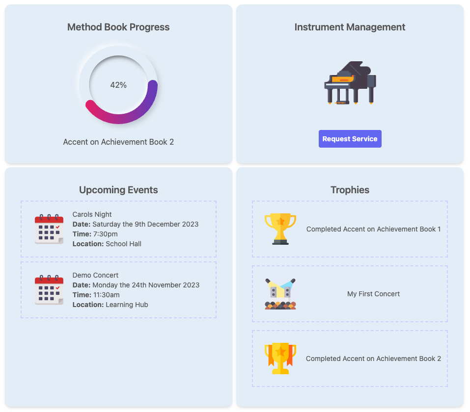

# TSA Parent Portal

_URL: https://parent-portal-three.vercel.app/_

As a music educator I've witnessed first hand the importance of keeping parents involved in their childs education. In building the Teaching Services Australia Parent Portal I set out to build a simple, user-friendly tool that could give busy parents immediate feedback on their child's progress in our music programs. More broadly I envision it as a hub for TSA to manage all relevant communications to and requests from parents.

_Student Dashboard_

## Technologies Used

- React
- Next JS
- Next Auth
- Tailwind
- Prisma
- Zod

## Approach Taken

From a design perspective I had two overarching goals:

1. Build a visually appealing and responsive UI
2. Write modular code that leaves room to add or remove features as the design coalesces

For the first point I decided to use Tailwind and was pleasantly suprised by how easy it was to use. I was quickly able to create an appealing front end and with the help of some icons from flaticon.com bring it to life. The burger menu was adapted from the Josh Comeau's Joy of React course which has been a treasure trove of guidance in working with React.

For the second point writing in React made writing modular code easy and fun. Using Next JS in particular forced me to structure my code into client and server side components which encouraged me to break components into smaller parts.

## Further Work

This project was created as a proof of concept for my employer with a lot of room for development. Here is a partial list of features I would like to add:

- An expanded enrolment form which linked to Stripe to process customer payments
- A back-end for handling requests from customers
- A notifcation system, including an option for email notifications
